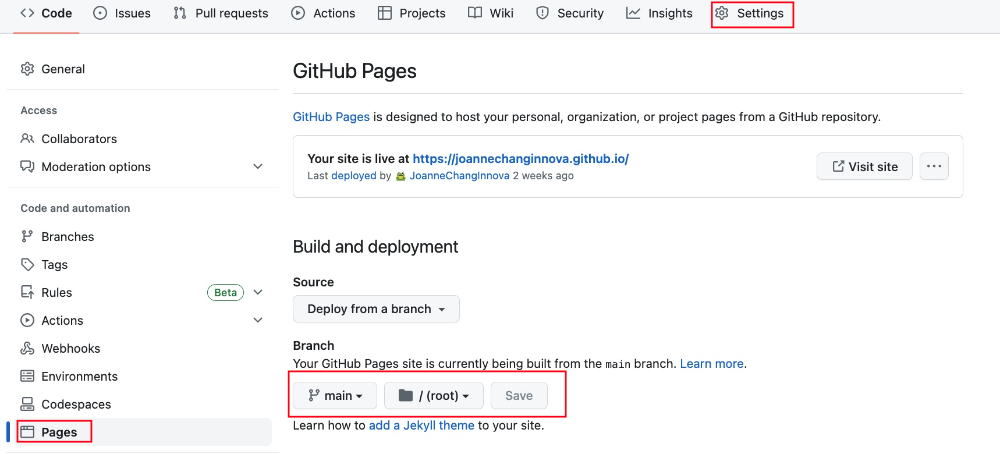
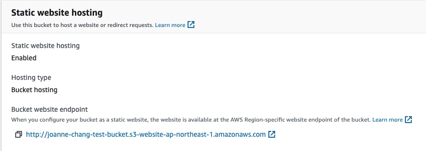
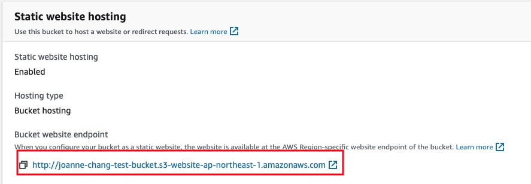

As a software engineer, my friends often approach me with requests like, "I need a personal website to showcase my projects. Do you know how to create one?" or "Can you build a website for my product?" Having a dedicated website can significantly enhance the professional image of a person or their product. If you share the same need, you might want to consider using a static site generator to build your website. It's a completely free and user-friendly tool, especially if you have some programming knowledge. To get you started, here's a  guidance of "the world's fastest static site generator - Hugo"

## Static Site Generator

A static site generator (SSG) creates a website by generating HTML, CSS, and JavaScript files during the build process. It combines the content with pre-defined templates. These static files can then be served to visitors directly from a web server without the need for any server-side processing.

In contrast, a dynamic site relies on server-side processing to generate and deliver content on the fly. The web server dynamically generates HTML and other content based on the user's request and data retrieved from a database or other sources. This allows for dynamic content updates, user interactions, and personalized experiences.

## Who should use it?

Static sites offer advantages such as faster loading times, better security, and simpler hosting requirements since they don't require server-side processing. They are well-suited for websites with relatively static content, such as blogs, corporate websites, creative portfolios, online magazines, single page applications or even a website with thousands of pages.

## Hugo - Static Site Generator

Written in Go, Hugo is an open source static site generator. Hugo supports TOML, YAML and JSON data file types, Markdown and HTML content files and uses shortcodes to add rich content.

## How Fast is Hugo?

What’s modern about waiting for your site to build? Hugo is the fastest tool of its kind. At <1 ms per page, the average site builds in less than a second.

## Quick Start

### installation

[Hugo Official Document](https://gohugo.io/installation/)

###  Theme
pick one for your website:  
 [Hugo Themes](https://themes.gohugo.io/) 

I recommended these easy-to-follow themes: [Coder](https://themes.gohugo.io/themes/hugo-coder/) , [Eternity](https://themes.gohugo.io/themes/eternity/)

###  Basic Commands
Create hugo directory structure:
```markdown
hugo new site <site-name>
cd <site-name>
git init
```

Clone the theme into the /themes directory, adding it to your project as a Git submodule.
```markdown
git submodule add https://github.com/<theme-repo-url> themes/<theme-name>
```

Usually there's a example site under themes directory, it's better to that to root directory, so you can get all the contents as same as the themes demo and your site will be ready to run up at this point.
```markdown
cp -a themes/<theme-name>/exampleSite/. .
```

Start Hugo’s development server to see your changes in local
```markdown
hugo serve -D
```

Publish the site. This will create the entire static site in the public directory in the root of your project.
```markdown
hugo
```

### Hosting on GitHub Pages
1.create a Github repository
```markdown
- user site: https://<username>.github.io/
- project sites: https://<username>.github.io/<repository>/
```
You can only create one user site for each account on GitHub. Project sites are unlimited.

2.edit the baseURL as the above Github repository url in config.toml(or .yml) in the root directory.

3.upload files to repository

```markdown
cd public
git init
git add .
git branch -M main
git commit -m "first commit"
git remote add origin <git-repo>
git push -u origin main
```

4.start building:



### Hosting for AWS S3

1.create S3 bucket using AWS CLI:   
```markdown
# add secret access key and region of your account (create one in Security Credentials)
aws configure 
# create bucket
aws s3 mb s3://bucket-name
# check all buckets
aws s3 ls
```

2.enable static website hosting     


3.permission > edit bucket policy  
```markdown
{
    "Version": "2012-10-17",
    "Statement": [
        {
            "Sid": "PublicReadGetObject",
            "Effect": "Allow",
            "Principal": "*",
            "Action": "s3:GetObject",
            "Resource": "arn:aws:s3:::<bucket-name>/*"
        }
    ]
}
```
this will allow public read and get all files in your bucket  

4.upload files
```markdown
aws s3 sync . s3://my-bucket/
```

5.Finish! the website url is under *properties* > Static website hosting     
